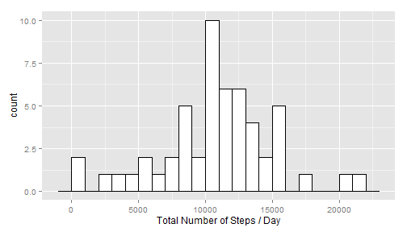
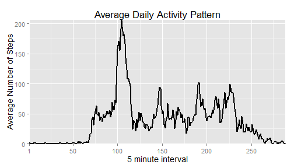
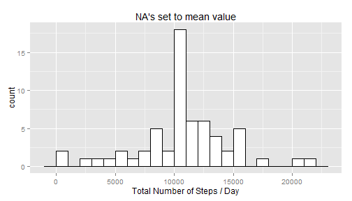
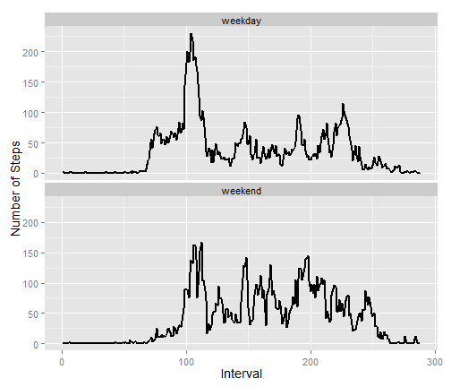

# Reproducible Research: Peer Assessment 1
The objective of this assignment is to evaluate data anonymously collected from 
a personal activity monitoring device. This data contains samples measured at 
five minute intervals during the months of October and November 2012. In 
addition, the [Peer Assessment assignment #1 description][1] includes the 
following definition of the variables contained in this data set:
* steps: Number of steps an individual takes during a five minute interval  
* date: "The date on which the measurement was taken in YYYY-MM-DD format"  
* interval: "Identifier for the 5-minute interval in which [the] measurement was
taken"

The objective of the following code chunk is to setup the R language 
environment by performing four operations. First, this code chunk defining
a character vector (i.e. required.packages) that defines the required packages. 
The second operation performed by this R software is initializing charater 
vector (i.e. new.packages) based on a [comparison of required packages with the 
currently installed packages][2]. Third, this code chunk installs the required
packages by passing the new.packages character vector to the install.packages 
function. The fourth operation performed by this R code chunk is loading the 
following required packages:
* data.table  
* ggplot2  
* lubridate  

```r
# Verify required packages are installed
required.packages <- c("lubridate",
                       "data.table",
                       "ggplot2",
                       "xtable")

new.packages <- required.packages[!(required.packages %in% 
                                    installed.packages()[,"Package"])]

if(length(new.packages)) {
  install.packages(new.packages)
} 

# Load required packages
library(data.table)
library(ggplot2)
library(lubridate)
```
## Loading and preprocessing the data
The template [Github repository][1] for this assignment includes a compressed 
file (i.e activity.zip) that contains the personal activity monitoring data.
Therefore, the first step performed by the following code chunk is to determine
whether or not a "Data" directory has been created. If not, the R software 
contained in this if statement creates the "Data" directory and [extracts the
data from activity.zip][3] Next, the activity data comma separated value file
is read from disk with the [header option set to TRUE and the stringsAsFactors 
option set to false][4]. The third operation performed by this R code chunk is 
transforming the character date variable in a POSIXct class using the ymd (i.e,
"year","month","day") function from the [lubridate][5] R package.

```r
if (!file.exists("./Data")) {
    dir.create("./Data")    
    unzip("./activity.zip", exdir="Data")
}

activityData <- read.csv("./Data/activity.csv",
                         header=TRUE,
                         stringsAsFactors=FALSE)

activityData$date <- ymd(activityData$date)
```
During exploratory data analysis I noticed that the 5 minute intervals did not 
correspond to the number of 5 minute intervals in a 24-hour period.  

```r
numberOfFiveMinuteIntervals <- 12 * 24

originalIntervals <- unique(activityData$interval)
minOriginalIntervals <- min(originalIntervals)
maxOriginalIntervals <- max(originalIntervals)
```
For example, there are numberOfFiveMinuteIntervals = 
288 5 minute intervals in a day. However, the 
original 5-minute intervals range from [minOriginalIntervals,
maxOriginalIntervals]: [0,2355]. 
Therefore, the purpose of the following code chunk is to:  
1. Convert the 5-minute interval variable into a factor variable in order to 
facilitate computing the average daily activity.  
2. Set the 5-minute intervals to correspond to the number of 5 minute intervals
in one twenty-four hour period.  
3. Convert the data frame that contains the personal activity monitoring device 
data (i.e. activityData) into a [data.table][6]

```r
activityData$interval <- as.factor(activityData$interval)

levels(activityData$interval) <- seq(1,length(originalIntervals))

activityData <- data.table(activityData)
```
## What is mean total number of steps taken per day?
My rationale for transforming the activityData variable from a data.frame
to a data.table is that this data type was designed to work with large 
datasets. For example, the first statement in the 
computeTotalNumberStepsPerDay() function defined in the following code chunk 
computes the total number of steps per day using data.table's [aggregation 
functionality][7]. In addition, this statements excludes observations that
contains missing values (i.e. NA) using the [complete.cases][8] function. This
statement also transforms the output of this aggregation back into a data.frame.

```r
computeTotalNumberStepsPerDay <- function(activityData) {
    totalNumberStepsPerDay <- 
        as.data.frame(activityData[complete.cases(activityData),
                                   sum(steps),by=date])
    
    colnames(totalNumberStepsPerDay) <- c("date","totalnumberofsteps")
    
    return(totalNumberStepsPerDay)
}

totalNumberStepsPerDay <- computeTotalNumberStepsPerDay(activityData)

numberUniqueIntervals <- nrow(totalNumberStepsPerDay)

numberIntervals <- nrow(activityData)
```
My rationale for this approach is that the number of observations in the 
data.table that contains the total number of steps per day (i.e. 
maxOriginalIntervals = 53
is significantly less than the number of rows in the original data (i.e. 
numberIntervals = 17568). Therefore, storing the data in a 
data.frame or a data.table are both equally valid design decisions. For example,
the name that contains the total number of steps per 5-minute interval can
be set using the *colnames()* function or via the [data.table assignment 
syntax][9].


```r
ggplot(totalNumberStepsPerDay, aes(x=totalnumberofsteps)) +
    geom_histogram(binwidth=1000,fill="white",colour="black") + 
    xlab("Total Number of Steps / Day")
```

 

```r
cat(sprintf("Mean total number of steps taken per day: %.1f", 
            mean(totalNumberStepsPerDay$totalnumberofsteps)),
    sprintf("Median total number of steps taken per day: %.1f", 
            median(totalNumberStepsPerDay$totalnumberofsteps)),
    fill=TRUE,
    sep="\n")
```

```
## Mean total number of steps taken per day: 10766.2
## 
## Median total number of steps taken per day: 10765.0
```


## What is the average daily activity pattern?

```r
dailyActivty <- as.data.frame(activityData[complete.cases(activityData),
                                           mean(steps),
                                           by=interval])

dailyActivty$interval <- as.numeric(dailyActivty$interval)
colnames(dailyActivty) <- c("interval","averagenumberofsteps")

ggplot(dailyActivty, aes(x=interval,y=averagenumberofsteps)) + 
    geom_line(size=1) +
    coord_cartesian(xlim=c(min(dailyActivty$interval),
                           max(dailyActivty$interval)),
                    ylim=c(min(dailyActivty$averagenumberofsteps),
                           max(dailyActivty$averagenumberofsteps))) +
    theme_gray(base_size=14) + 
    xlab("5 minute interval") + 
    ylab("Average Number of Steps") +
    ggtitle("Average Daily Activity Pattern") +
    scale_x_continuous(breaks=c(1,50,100,150,200,250))
```

 

```r
maxInterval <- 
    as.integer(dailyActivty[which(dailyActivty$averagenumberofsteps == 
                                  max(dailyActivty$averagenumberofsteps)),
                            "interval"])

maxIntervalTime <- as.POSIXlt(paste(activityData[1,date],"00:00:00"))
maxIntervalTime$min <- maxIntervalTime$min + maxInterval*5
maxIntervalTime <- strftime(maxIntervalTime,"%H:%M (24 hour)")
```

On average across all the days in the dataset, the five minute interval that 
contains the maximum number steps is #104 which corresponds to   
08:40 (24 hour).

## Imputing missing values

```r
totalNumberMissingValues <- nrow(activityData) - 
                            sum(complete.cases(activityData))
```

The total number of missing values is 2304, which is 
computed as by subtracting the number of rows where all of the variables (i.e. 
columns) are specified from the total number of rows.


```r
dailyActivty$interval <- as.factor(dailyActivty$interval)

for (n in seq(1,nrow(dailyActivty))) {
    intervalIndex <-
        which(activityData$interval == dailyActivty[n,"interval"])
    
    naIndex <- 
        intervalIndex[is.na(activityData[intervalIndex,steps])]
    
    avgIntegerNumberOfSteps <- 
        as.integer(round(dailyActivty[n,"averagenumberofsteps"]))
    
    activityData[naIndex,steps:=avgIntegerNumberOfSteps]
}

totalNumberStepsPerDay <- computeTotalNumberStepsPerDay(activityData)

ggplot(totalNumberStepsPerDay, aes(x=totalnumberofsteps)) +
    geom_histogram(binwidth=1000,fill="white",colour="black") + 
    xlab("Total Number of Steps / Day") + 
    ggtitle("NA's set to mean value")
```

 

```r
cat(sprintf("Mean total number of steps taken per day: %.1f", 
            mean(totalNumberStepsPerDay$totalnumberofsteps)),
    sprintf("Median total number of steps taken per day: %.1f", 
            median(totalNumberStepsPerDay$totalnumberofsteps)),
    fill=TRUE,
    sep="\n")
```

```
## Mean total number of steps taken per day: 10765.6
## 
## Median total number of steps taken per day: 10762.0
```

## Are there differences in activity patterns between weekdays and weekends?


```r
assign("depthtrigger", 60, data.table:::.global)
activityData[,daytype:=weekdays(date)]

weekday <- c("Monday",
             "Tuesday",
             "Wednesday",
             "Thursday",
             "Friday")

for (curDay in weekday) {
    activityData[which(activityData$daytype == curDay),daytype:="weekday"]
}

weekendDay <- c("Saturday",
                "Sunday")

for (curDay in weekendDay) {
    activityData[which(activityData$daytype == curDay),daytype:="weekend"]
}

activityData$daytype <- as.factor(activityData$daytype)

activityData$interval <- as.numeric(activityData$interval)

activityPattern <- as.data.frame(activityData[,mean(steps),by=list(daytype,interval)])

colnames(activityPattern) <- c("daytype","interval","avgnumberofsteps")

ggplot(activityPattern,aes(x=interval,y=avgnumberofsteps)) + 
    geom_line(size=1) + 
    theme_gray(base_size=14) +
    facet_grid(daytype ~ .) + 
    facet_wrap(~daytype,nrow=2) + 
    xlab("Interval") + ylab("Number of Steps")
```

 
[1]: https://github.com/rdpeng/RepData_PeerAssessment1
[2]: http://stackoverflow.com/questions/9341635/how-can-i-check-for-installed-r-packages-before-running-install-packages
[3]: http://www.r-bloggers.com/read-compressed-zip-files-in-r/
[4]: http://cran.r-project.org/doc/contrib/de_Jonge+van_der_Loo-Introduction_to_data_cleaning_with_R.pdf
[5]: http://www.jstatsoft.org/v40/i03/paper
[6]: http://www.londonr.org/LondonR-20090331/data.table.LondonR.pdf
[7]: http://datatable.r-forge.r-project.org/
[8]: http://stackoverflow.com/questions/4862178/remove-rows-with-nas-in-data-
frame
[9]: http://stackoverflow.com/questions/6407239/how-to-change-the-datatable-column-name
